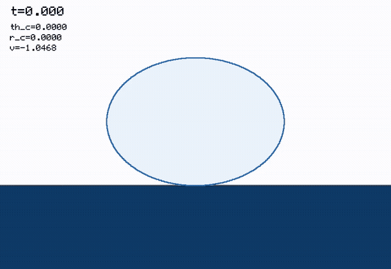

# A fully spectral kinematic match for droplet–bath impact

[](https://github.com/elvis-aguero/DropImpact.jl/actions/workflows/ci.yml)

This repository is the numerical companion to a model of non-coalescing droplet
impact on a liquid bath in which **both** interfaces are spectral and the contact
pressure is solved for rather than assumed. The bath is a Fourier–Bessel series,
the droplet a Legendre series, and the contact pressure a shifted-Legendre series
supported exactly on the contact patch. Nothing sits on a mesh; the free boundary
is determined by a complementarity condition rather than by a prescribed pressure
shape or a discrete tangency search over mesh points.



*(Full-resolution MP4: `julia/output/media/impact_We1.0958_hires.mp4`.)
Output of `run_simulation` for the water case `We = 1.0958`, `Bo = 0.017`,
`Oh = 0.006` at `M = L = 120`, `N = 6`. Dark blue is the bath, pale blue the
droplet, and the red arc is the contact patch `θ ∈ [0, θ_c]`. The inset is the
solved pressure profile over that patch — an output of the model rather than a
prescribed shape, though not a converged one; see "Choosing `M`, `L`, `N`".*

It sits between two published models and takes something from each. From
Alventosa, Cimpeanu & Harris (2023, *JFM* **958**, A24) — the "1PKM" — it takes the
spectral representation of both interfaces and their modal oscillator equations.
From Agüero et al. (2026) — the "full KM" — it takes contact enforced over the
whole pressed region with the pressure as a genuine unknown, and the practice of
selecting the contact extent by a feasibility-filtered residual rather than a
root-find. What is new here is that the pressure is spectral rather than
mesh-resolved, and that the contact angle is a parameter of an outer scalar
search rather than an unknown in a joint algebraic system.

| Path | Contents |
|---|---|
| `julia/` | The `SpectralKM` package: model, time stepper, validation and rendering scripts. |
| `docs/next-gen-KM-model.tex` | The model derivation — the physics ground truth for `julia/`. Includes a section recording arguments from earlier revisions that were wrong, and why. |
| `docs/BouncingDroplets.tex`, `docs/Deformable_impactors.tex` | The two parent papers, for reference and for the claims the derivation makes about them. |
| `derivations/` | CAS and numerical audit scripts backing specific claims in the `.tex`. Every measurement the document quotes is produced by one of them. |

## Setup

Requires Julia 1.10+ and, for the renderer only, `ffmpeg` on `PATH`. The package
itself has no plotting dependency.

```bash
cd julia && julia --project=. -e 'using Pkg; Pkg.instantiate()'
```

## Running a simulation

```julia
using SpectralKM

p = Params(We = 1.0958, Bo = 0.017, Oh = 0.006,   # water, R = 0.35 mm
           M = 60, L = 60, N = 3,                  # bath / droplet / pressure modes
           b = 6.0, h0 = 3.0, nq = 40)             # bath radius, depth, quadrature order

levels, diag = run_simulation(p; t_end = 8.0, dt_init = 1e-3)
```

`levels` is the trajectory: one `Level` per accepted step, holding the bath modes
`a_m`, droplet modes `β_l`, centre-of-mass height and velocity, and the solved
`X = (ĉ_0…ĉ_N, θ_c)`. `diag` carries per-step contact diagnostics — contact angle,
net force `f`, tangency residual, Newton status.

### Choosing `M`, `L`, `N`

`M` and `L` are set by convergence; `N` is a different kind of parameter and the
distinction matters. Convergence is judged on **contact time**, not the
coefficient of restitution — CoR is the easiest metric to converge and will look
settled long before anything else is. At `We = 1.0958`:

| `(M,L,N,nq)` | wall (s) | contact time | CoR | max width |
|---|---|---|---|---|
| `(30,30,3,30)` | 68 | 2.152 | 0.5399 | 1.795 |
| `(60,60,3,40)` | 24 | 4.2624 | 0.2996 | 1.1225 |
| `(60,60,6,60)` | 52 | 4.2624 | 0.2996 | 1.1225 |
| `(120,120,6,60)` | 99 | 4.2646 | 0.2995 | 1.1225 |
| `(120,120,10,80)` | 177 | 4.2646 | 0.2996 | 1.1225 |

`M = L = 30` is badly unconverged — a contact time half the correct value, and a
width and CoR that are not physical. From `M = L = 60` contact time is settled to
five digits and doubling the mode counts moves it by 0.05 %.

**`N` does not converge the pressure, and should not be read as if it did.**
Sweeping `N` along a real trajectory at `M = L = 60`:

| `N` | contact time | CoR | max `r_c` | `‖Δp‖/‖p‖` vs `N=16` | `Δf/f` vs `N=16` |
|---|---|---|---|---|---|
| 2 | 4.26239 | 0.29959 | 0.8192 | — | — |
| 3 | 4.26239 | 0.29959 | 0.8183 | 0.46 – 0.96 | 1e-5 – 1e-2 |
| 6 | 4.26239 | 0.29960 | 0.8124 | | |
| 10 | 4.26239 | 0.29962 | 0.8062 | | |
| 16 | 4.26239 | 0.29962 | 0.7999 | | |

Contact time is identical to six significant figures across the whole range,
while the solved pressure *profile* at `N = 3` differs from `N = 16` by 46–96 %
in relative L2 over the patch. Both facts are real and they are not in tension:
the compliance operator is compact, so pressure modes beyond a few sit in its
numerical nullspace, and the pressure influences the dynamics *only* through the
moments `c_m`, `b_l`, `f` — which agree to between `1e-5` and `1e-2`. Refining
`N` buys a different-looking pressure profile and the same physics.

So use `M = L = 60`, `N = 3`, `nq = 40` for trajectories, but do not quote the
pointwise pressure as a converged output of the model at any `N`. The one
observable that does drift with `N` is the maximum contact radius (0.8192 down to
0.7999, monotonically, and *away* from the DNS value 0.8821) — which is the
observable most sensitive to the pressure profile, and is also the one already
carrying an open discrepancy. That is a lead, not a coincidence.

## Validation

```bash
cd julia
julia --project=. scripts/validate_trajectory.jl   # vs experiment + DNS
julia --project=. scripts/validate_sweep.jl        # rebound metrics vs We
```

Validation is against **measurement**, not against another model. The reference
is `data/reference/experimental/` — the droplet top and bottom trajectories with
error bars, from the experiments that supersede Alventosa et al. (2023). See that
directory's `PROVENANCE.md`.

```
experimental uncertainty from 293 digitised bar caps: median 0.1004 (quartiles 0.0810, 0.1179)

series         n     mean|err|  max|err|   RMS        RMS/bar
droplet top    60    0.1345     0.2503     0.1526     1.52
droplet bottom 39    0.1055     0.2580     0.1221     1.22
combined       99    0.1231     0.2580     0.1414     1.41
```

The model tracks the measured trajectory at about 1.4 times the experimental
error bar — the same order as the measurement uncertainty, but outside it, so the
residual is model error rather than scatter.

**What cannot be validated against experiment, and is therefore not claimed.**
The dataset contains no measured contact radius and no measured droplet width;
both exist only as DNS and 1PKM series (verified by reading the WebPlotDigitizer
projects — each contains exactly two datasets, `*_DNS` and `*_1PKM`). Comparisons
of those quantities are model-to-simulation, and additionally definition-sensitive:
the DNS contact radius is thresholded on the trapped gas film, whereas this
model's `θ_c` bounds the kinematically matched region. `validate_trajectory.jl`
still reports them for information; they are not validation.

On that footing the contact-radius discrepancy needs restating. Against DNS the
model's `r_c` peaks at `τ ≈ 0.89` versus `1.46`, and doubling `M` and `L` moves
that by 0.02, so it is not a resolution effect. But the early peak is partly a
property of this class of reduced model rather than of this model alone: 1PKM
peaks at `τ ≈ 1.22`, also early against the same DNS. Normalising by contact
time, the peak falls at 0.20 of the way through contact here, 0.26 for 1PKM and
0.33 for DNS. So the model is more skewed than 1PKM but in the same direction,
and there is no measurement to adjudicate between them. Whether the remainder is
a defect or a definition mismatch is open.

There is also an isolated performance pathology, and it is *not* a low-Weber
trend as an earlier note here claimed. Timed across the range at `M = L = 60`:

| `We` | wall (s) | steps | ms/step | contact time |
|---|---|---|---|---|
| 0.0121 | 48 | 719 | 67 | 13.999 (hit the `t_end` cap) |
| 0.0646 | 27 | 732 | 36 | 4.776 |
| 0.3000 | **555** | 930 | **597** | 4.369 |
| 1.0958 | 23 | 743 | 31 | 4.262 |
| 3.0000 | 24 | 746 | 32 | 4.186 |

`We ≈ 0.3` costs twenty times more per step than either of its neighbours, which
is a localised defect — most likely the feasibility band search thrashing — and
not a smooth trend in `We`. Separately, `We = 0.0121` never terminates contact
within `t_end = 14`. Both are open. `scripts/validate_sweep.jl` will run, but
expect one or two points to dominate its wall time and the lowest `We` to report
a contact time truncated by the integration window.

## Rendering

```bash
julia --project=. scripts/make_video.jl [We] [outfile.mp4] [M] [L] [N] [nq]
```

Writes an MP4 to `julia/output/media/`. Dependency-free by construction: it
rasterises PPM frames itself and pipes them to `ffmpeg`, so the library never
acquires a plotting stack.

## Tests

```bash
cd julia && julia --project=. -e 'using Pkg; Pkg.test()'
```

CI runs the same command on every push to `main` and `dev`
(`.github/workflows/ci.yml`). Coverage includes the Legendre and Bessel
primitives, Gauss–Legendre exactness on the projection integrands, the BDF2
affine reduction, the inner Galerkin residual, and the contact-step machinery.

## Derivation audits

`derivations/` holds the scripts that back specific quantitative claims in the
`.tex`, and they are meant to be run, not trusted:

| Script | Establishes |
|---|---|
| `verify_legendre_pressure_basis.jl` | The shifted-Legendre pressure basis is exactly degree `n` in `x`, and the projection integrands have the degrees the quadrature bookkeeping assumes — exactly, in `Rational{BigInt}`, through `n = 80`. |
| `audit_compliance_operator.jl` | Self-adjointness, definiteness, `δ`-scaling and resolvable rank of the pressure→gap compliance operator. |
| `audit_nested_closure.jl` | The inner system's conditioning is flat in `δ` and of order unity, against `~1e18` for the joint system it replaces. |
| `audit_weak_determinacy.jl` | Which functionals converge in `N` and which do not, and the identifiability of the self-adjointness diagnosis. |
| `probe_global_basis_argmin.jl` | Records a formulation that **fails**: a global pressure basis with weakly-imposed zero pressure off the patch, selected by minimising an integrated residual. |

Scripts marked `SUPERSEDED` in their header verify claims that have since been
withdrawn; they are retained for the record and should not be read as support for
the current model.
